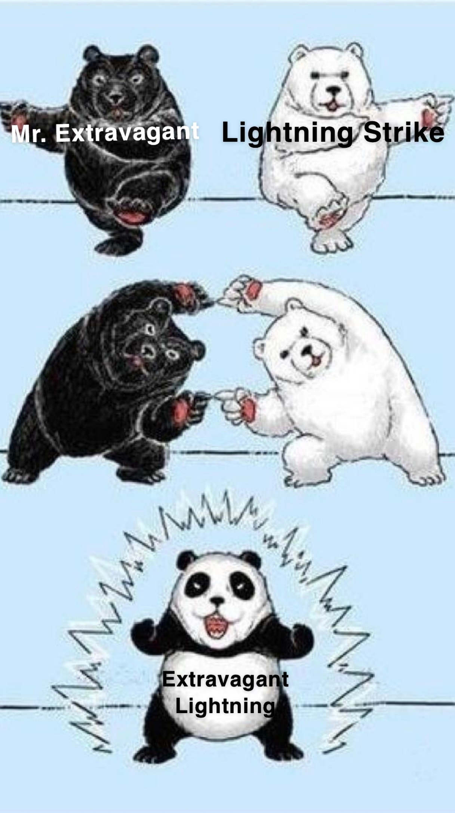
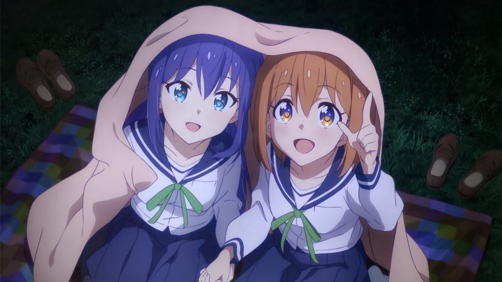
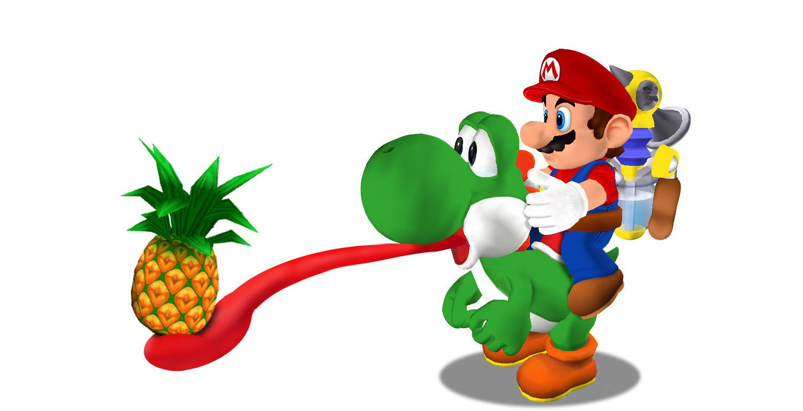

)

# Homework 1 for Team Extravagant Lightning

TODO:
Dan- I am from Lindsay, Ontario. My hobbies include video games, collecting trading cards, dressing up in cosplay, and shopping, especially for collectibles. My favourite video game series is Pokemon, my favourite movie is Detective Pikachu, and my favourite anime series is Koisuru Asteroid/Asteroid in Love. 

Charlie- I am from London, Ontario. Born and raised. My hobbies include video games, model trains, comic books, movies, writing. Some of my favourite movies include Pulp Fiction, Toy Story, Sam Raimi's Spider-Man trilogy, almost every Star Wars movie, and the first three Inidana Jones movies we don't talk about Kingdom of the Crystal Skull. 

 

## Usage

TODO: Write usage instructions

## Contributing

1. Fork it!
2. Create your feature branch: `git checkout -b my-new-feature`
3. Commit your changes: `git commit -am 'Add some feature'`
4. Push to the branch: `git push origin my-new-feature`
5. Submit a pull request :D

## Credits

Dan Singer (Lightning)
Charlie Renaud (Mr Extravagent)

## License

MIT